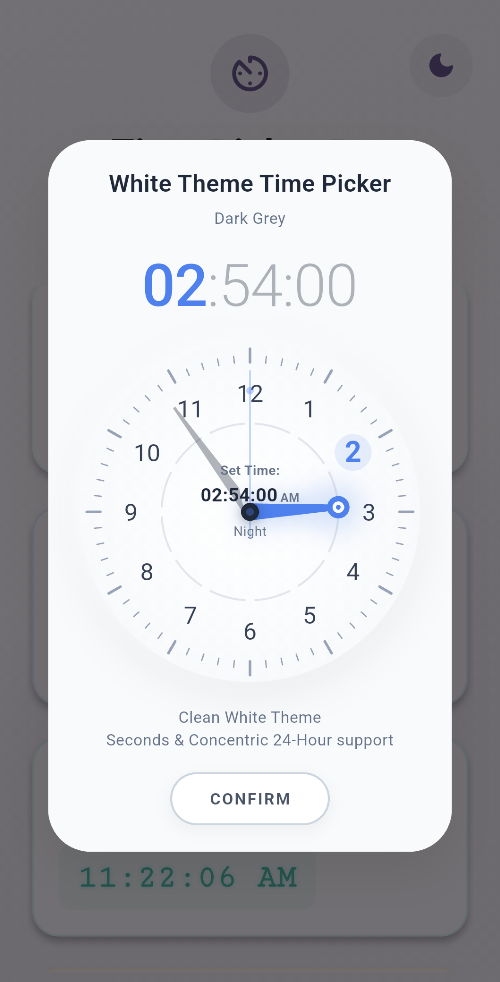
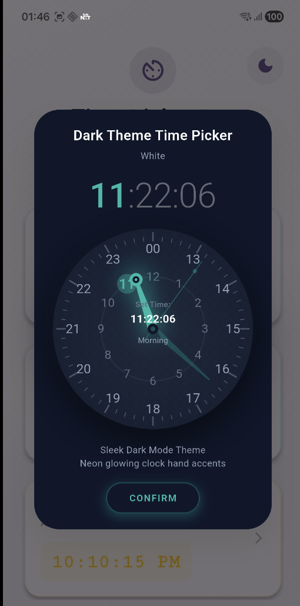
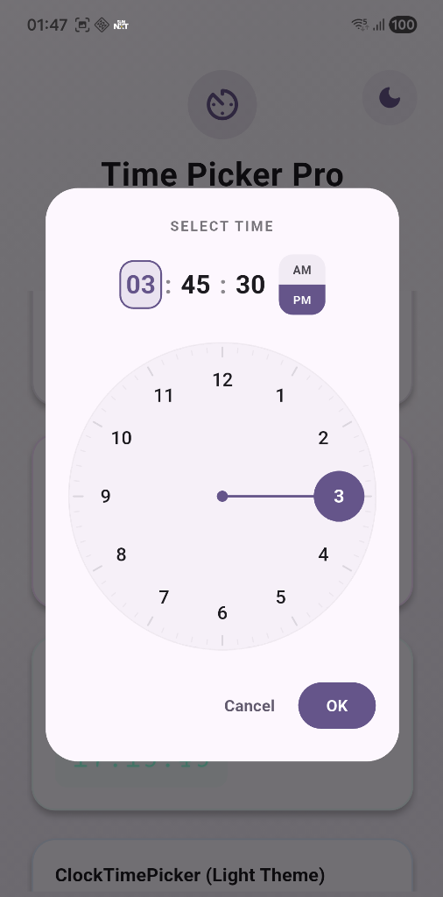
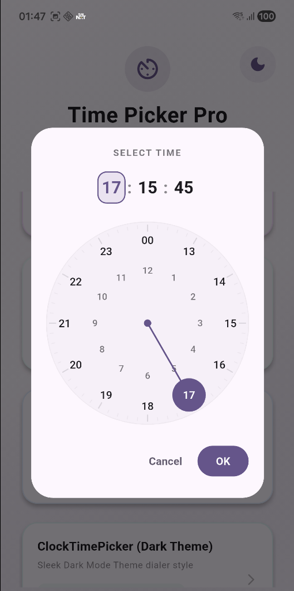
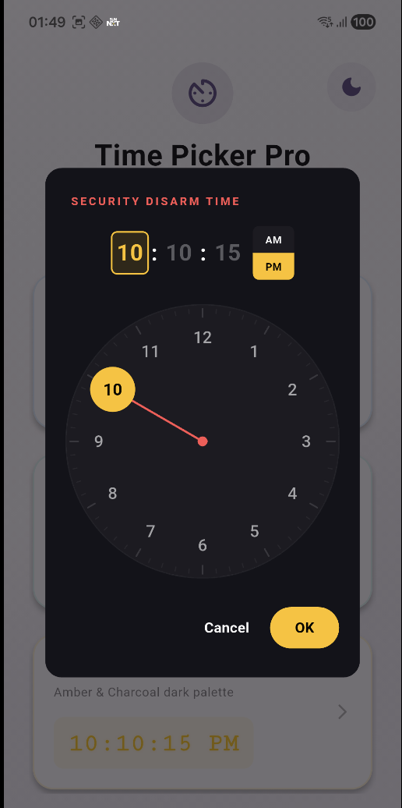

# Time Picker Pro

[](https://pub.dev/packages/time_picker_pro)
[](https://pub.dev/packages/time_picker_pro)
[](https://opensource.org/licenses/MIT)

A highly customizable, high-precision custom clock time picker for Flutter featuring **Seconds Selection**, **Concentric 24-Hour Dial**, and extensive **Typography and Color Theme customizers**.

---

## Why Time Picker Pro?

While Flutter includes a default `showTimePicker` built-in, it lacks native support for **seconds selection**. 

This package fills that gap:
- ⏱️ **Adds Precision Seconds Selection**: Seamlessly integrated into a familiar, high-performance clock dial interface.
- 🪶 **Zero Bloatware / Pure Dart**: Built entirely in pure Dart and Flutter (using custom gestures and `CustomPaint`/`Canvas`). It has **zero native dependencies** and a very tiny package size, keeping your application bundle light.
- 🎨 **Unlimited Customization**: Allows deep configuration (titles, alignments, active/inactive fonts, border radiuses, custom clock hand, and pointer bubble paint colors) that the default Flutter time picker does not easily expose.

---

## Showcase Screenshots & Videos

### Interactive Video Demonstrations
<p align="center">
  <video src="assets/video_1.mp4" width="45%" controls></video>
  &nbsp;&nbsp;&nbsp;&nbsp;
  <video src="assets/video_2.mp4" width="45%" controls></video>
</p>

### Clock Dial Themes
<p align="center">
  
  &nbsp;&nbsp;
  
  &nbsp;&nbsp;
  
</p>
<p align="center">
  
  &nbsp;&nbsp;
  
</p>

---

## Features

- 🕒 **Precision Seconds Selection**: Includes support for high-precision time selection (Hour, Minute, and Second).
- 🔄 **Concentric 24-Hour Dial**: Implements a double concentric ring face. Selecting inner hours (1 to 12) automatically shortens the clock hand (`radius * 0.52`), while outer hours (13 to 23, 00) lengthens it (`radius * 0.82`), matching native Android behaviors.
- 🎨 **Granular Styling Control**: 
  - **Header & Title**: Customize title text, custom font styles, custom alignment, and layout padding.
  - **Typography**: Override styles for active/inactive timing digits, separators, and active/inactive AM-PM buttons.
  - **Borders & Shapes**: Customize the border radius for the Dialog card as well as time segment wrappers.
  - **Pointer Customization**: Configure custom paint colors for the clock hand line and selection bubble tip.
- 📳 **Haptic Clicks**: Emits micro haptic vibrations when dragging the hand past ticks, giving a physical, tactile feel.
- 📱 **Layout-Safe Sizing**: Sizing automatically shrinks when seconds are visible to fit comfortably on narrow phone viewports.
- 🌓 **Dynamic Light/Dark Modes**: Automatically inherits and adapts styling based on system brightness theme context out of the box.

---

## Installation

Add `time_picker_pro` to your `pubspec.yaml` dependencies:

```yaml
dependencies:
  time_picker_pro:
    path: path/to/local/time_picker_pro # or pub version when published
```

Then, run:
```bash
flutter pub get
```

---

## Usage

Import the package in your Dart code:
```dart
import 'package:time_picker_pro/time_picker_pro.dart';
```

### 1. Basic 12-Hour Mode (With Seconds)
Opens a dialog with Hours, Minutes, and Seconds selector panels:

```dart
void _openTimePicker(BuildContext context) {
  showDialog(
    context: context,
    builder: (context) => CustomTimePicker(
      initialTime: const TimeOfDayWithSeconds(hour: 8, minute: 30, second: 15),
      showSeconds: true,
      onTimeSelected: (time) {
        print("Selected time: ${time.format12Hour()}"); // e.g. "08:30:15 AM"
      },
    ),
  );
}
```

### 2. Concentric 24-Hour Mode
Omits the AM/PM button, and presents a dual concentric ring dial:

```dart
void _open24hTimePicker(BuildContext context) {
  showDialog(
    context: context,
    builder: (context) => CustomTimePicker(
      initialTime: const TimeOfDayWithSeconds(hour: 17, minute: 15, second: 00),
      showSeconds: true,
      use24HourFormat: true, // <-- Activates concentric dial
      onTimeSelected: (time) {
        print("Selected 24h time: ${time.hour}:${time.minute}:${time.second}");
      },
    ),
  );
}
```

### 3. Highly Customized Theme (e.g. Alarm Panel)
You can customize title positioning, typography, border shapes, hand color, and bubble tip colors:

```dart
void _openCustomThemedPicker(BuildContext context) {
  showDialog(
    context: context,
    builder: (context) => CustomTimePicker(
      initialTime: const TimeOfDayWithSeconds(hour: 22, minute: 0, second: 0),
      showSeconds: true,
      titleText: "SECURITY DISARM TIME",
      titleStyle: const TextStyle(
        color: Colors.redAccent,
        fontSize: 11,
        fontWeight: FontWeight.w800,
        letterSpacing: 2.0,
      ),
      titleAlignment: TextAlign.left,
      titlePosition: Alignment.centerLeft,
      titlePadding: const EdgeInsets.only(left: 4, bottom: 16),
      borderRadius: BorderRadius.circular(16),
      segmentBorderRadius: BorderRadius.circular(6),
      timeSegmentStyle: const TextStyle(
        fontSize: 22,
        fontWeight: FontWeight.bold,
        color: Colors.white30,
      ),
      activeTimeSegmentStyle: const TextStyle(
        fontSize: 22,
        fontWeight: FontWeight.bold,
        color: Colors.amber,
      ),
      backgroundColor: const Color(0xFF13131A),
      dialBackgroundColor: const Color(0xFF1C1B22),
      dialTextColor: Colors.white60,
      dialSelectedTextColor: Colors.black,
      handColor: Colors.redAccent,       // Custom hand line paint
      selectionBubbleColor: Colors.amber, // Custom tip selection bubble paint
      textColor: Colors.white,
      onTimeSelected: (time) {
        print("Selected custom time: $time");
      },
    ),
  );
}
```

---

## API Reference

### `TimeOfDayWithSeconds`
An immutable class representing a time of day with hour, minute, and second.

| Constructor / Method | Description |
|---|---|
| `TimeOfDayWithSeconds(hour: int, minute: int, second: int)` | Standard constructor |
| `TimeOfDayWithSeconds.now()` | Instantiates from current local system time |
| `TimeOfDayWithSeconds.fromDateTime(DateTime)` | Instantiates from standard DateTime |
| `TimeOfDayWithSeconds.fromTimeOfDay(TimeOfDay, [int second])` | Converts from standard TimeOfDay |
| `format12Hour()` | Formats as `hh:mm:ss AM/PM` (e.g. `02:05:12 PM`) |
| `toTimeOfDay()` | Converts to standard `TimeOfDay` (discards seconds) |

---

## Contributing

1. Fork it!
2. Create your feature branch: `git checkout -b feature/my-new-feature`
3. Commit your changes: `git commit -am 'Add some feature'`
4. Push to the branch: `git push origin feature/my-new-feature`
5. Submit a pull request!

## License

This project is licensed under the MIT License - see the LICENSE file for details.
